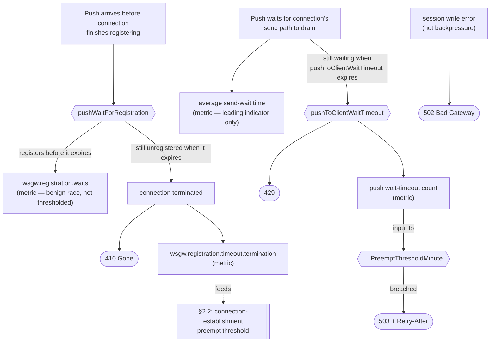
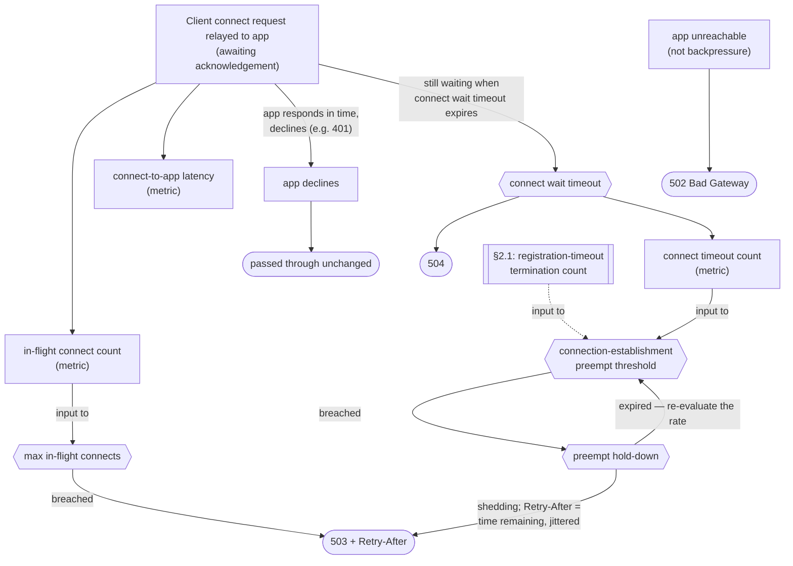
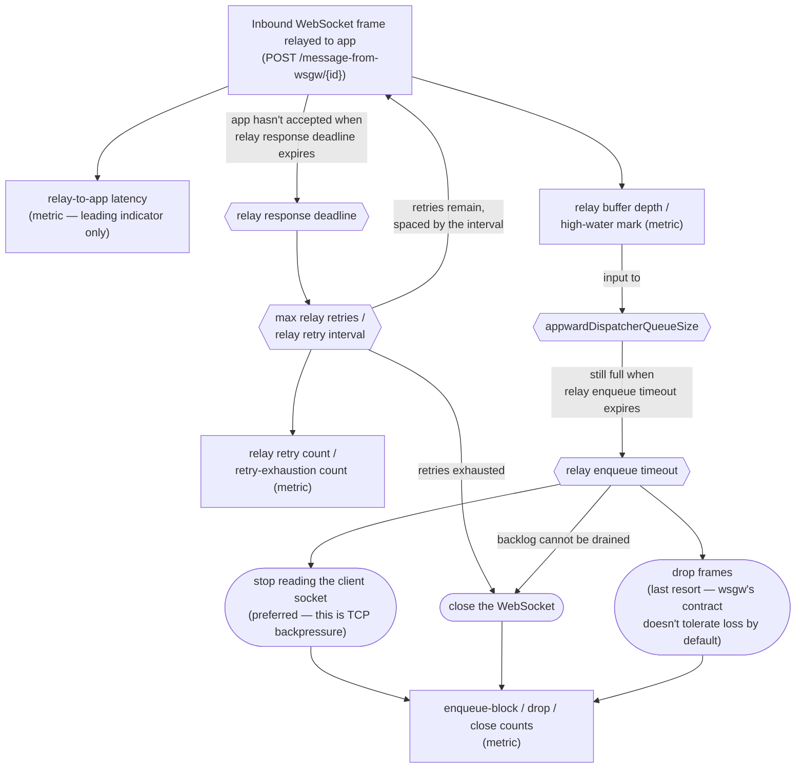

# Backpressure & Congestion Handling

This document is the single reference for the backpressure contract wsgw exposes:
how it detects congestion on each of its legs, what it does about it, and what it
tells its callers. It is written for two readers — the client author who must
handle the signals, and the operator who tunes the knobs and watches the metrics.

It is organized in two layers by depth of internal detail:

- **§1–§4 — the contract.** The external interface: signals, endpoints, knobs,
  metrics. Stable, and free of implementation references.
- **§5 — implementation & current status.** The implementor's working map: how
  much of the contract is live today, the internal mechanics behind it, and a
  per-element traceability table (§5.4) from contract to code. While the product
  is early-stage, this is the most active part of the document.

**How names are written here.** Configuration knobs appear in their camelCase
configuration form (`pushToClientWaitTimeout`); metrics appear under their
Micrometer name, which is dot-separated (`wsgw.registration.waits`). The two are
told apart by shape alone — no other marker is needed.

The Micrometer name is the metric's identity; each monitoring backend renders it
into its own dialect. Under Prometheus that rendering is more than a separator
swap: tags become labels, and the exporter appends a type- and unit-dependent
suffix.

| Meter | Micrometer name | Prometheus exposition |
|---|---|---|
| `Counter` | `wsgw.registration.waits` | `wsgw_registration_waits_total` |
| `Timer` | `wsgw.some.wait` (placeholder) | `wsgw_some_wait_seconds_count`, `…_sum`, `…_max` |

So a name from this document is not always paste-able into a Prometheus query —
derive it, or read it off the exporter. Note also that a *statistic* is not a
series: where this document says "average send-wait time", the query is that
timer's `_sum` divided by its `_count`.

A metric gets a name here once its meter exists; until then it is described in
prose, since the exact name and its tag dimensions are settled by the
implementation.

---

## 1. The signal contract (the vocabulary)

Three signals make up the entire backpressure vocabulary. Each means the same
thing wherever it is emitted, so a caller can treat the set as stable and key its
retry behaviour off the status code (and `Retry-After`).

| Signal | Meaning | Where the bottleneck is | `Retry-After` |
|---|---|---|---|
| **429 Too Many Requests** | This operation could not complete within its own wait budget. Reactive, per-request. | The gateway, right now, for this call. | Optional |
| **503 Service Unavailable** | The gateway is shedding load preemptively because a congestion metric crossed a configured threshold. Proactive. | The gateway, sustained. | Required |
| **504 Gateway Timeout** | The downstream app was too slow — it did not acknowledge a connect, or did not accept a relayed message, within its budget. | The backend app, not the caller. | Optional |

The axis that separates them: **429 and 503 say the client side is producing
faster than the gateway can drain** — 429 for a single call that ran out of
budget, 503 for "we've seen too much of that lately, back off." **504 says the
backend is slow** — a different party is at fault, so a caller's response should
differ.

One qualification on 503, because the axis above can mislead about it. 429 and
504 are *attributions*: each names the party whose behaviour caused this
particular call to fail. 503 is not an attribution. It is a protective measure
taken to keep the gateway stable, and the caller that receives it is generally
**not** the caller that caused the condition — it is simply the caller that
arrived while the condition held. A caller should read 503 as "the gateway is
conserving itself, come back later," and never as a judgement on its own rate.
This is also why `Retry-After` is required for 503 and optional elsewhere: the
caller has no way to infer from its own behaviour when someone else's condition
will clear, so the gateway must tell it.

Each signal carries a human-readable reason phrase for logs; programmatic callers key
off the status code and `Retry-After`.

New congestion sites (§2) map onto this same set rather than introducing codes of
their own — which is what lets a caller treat the vocabulary as fixed.

The three codes above are the *backpressure* vocabulary. A leg may also answer
with an ordinary HTTP code that has nothing to do with congestion — **502** when
the app is unreachable, **410** when the addressed connection no longer exists
(§2.1). These are not backpressure signals, they are not covered by the stability
promise above, and they are documented at the leg that emits them rather than
here.

---

## 2. Congestion catalog

Each congestion site sits on exactly one data-flow leg. There are three:

| Leg | Direction | Entry point | Section |
|---|---|---|---|
| **PUSH** | app → client | `POST /message/{connectionId}` | §2.1 |
| **CONNECT** | client → app | `GET /connect` | §2.2 |
| **RELAY** | client → app | inbound WebSocket frame (no HTTP entry) | §2.3 |

One asymmetry shapes the whole catalog: **PUSH and CONNECT are each triggered by
an inbound HTTP request, so the gateway can answer that request with a signal
from §1. RELAY is triggered by an inbound WebSocket frame — there is no HTTP
request in flight to answer — so it cannot emit a §1 signal at all, and the
actions it takes instead are different in kind.**

### 2.1 PUSH — slow message push, app → client

**Entry point.** `POST /message/{connectionId}` — the app hands the gateway a
payload to deliver as a text frame on the client's WebSocket.

**Trigger.** Delivery does not complete within its budget, typically because the
gateway↔client link is slow, which keeps that connection's send path busy so
further pushes to the same connection queue behind it.

**Knobs.**

| Knob | Controls |
|---|---|
| `pushWaitForRegistration` | How long a push waits for its target connection to finish registering. Applies only to pushes over a *just-opened* connection — one whose id the app already received as part of the new-connection notification but which is not yet available for client-ward traffic. When it expires, the gateway **terminates the connection** and answers 410. See "Why the gateway terminates" below. |
| `pushToClientWaitTimeout` | How long a push — over a fully functional WebSocket connection — waits for the connection's send path to drain before failing with 429. The push-congestion budget proper. |
| `pushToClientWaitTimeoutCountPreemptThresholdMinute` | `pushToClientWaitTimeout` expirations per minute above which the gateway sheds subsequent pushes preemptively with 503. |

**Metrics.**

| Metric | Meaning |
|---|---|
| average send-wait time | How long pushes wait for the connection's send path to free up; the leading indicator of push congestion. |
| push wait-timeout count | This counts pushes that failed on the wait timeout; input to the `…PreemptThresholdMinute` threshold. |
| `wsgw.registration.waits` | Connections where a push arrived before the connection had finished establishing (see §3). This counts the *race*, which is benign and normally clears in under a millisecond. It is not a distress signal, and thresholding it would shed load during healthy operation. |
| `wsgw.registration.timeout.termination` | This counts connections terminated because `pushWaitForRegistration` expired before they registered. Every increment is one connection destroyed and one client forced to reconnect, so unlike the race count above this **is** a distress signal. It is also a direct count of establishments that failed, which is why §2.2 uses it as an input to its preempt threshold. |

**Signals.**

| Condition | Signal |
|---|---|
| Send path fails to drain within `pushToClientWaitTimeout` | **429** |
| Connection not registered within `pushWaitForRegistration` | Connection **terminated**; push answers **410 Gone**, no `Retry-After` — see note below |
| `pushToClientWaitTimeoutCountPreemptThresholdMinute` exceeded | **503** + `Retry-After` |
| Session write error (not backpressure) | **502 Bad Gateway** |

**Dependencies.**

**Why the gateway terminates the connection.**

When a new WebSocket connection is opened, a sub-millisecond window may be open
in which the app is notified about the new connection and receives the
connection id, and the connection is not yet usable. `pushWaitForRegistration`
is how long the gateway is willing to sit in it before declaring the connection
a loss, at which point it destroys the connection.

### 2.2 CONNECT — slow connection establishment, client → app

**Entry point.** `GET /connect` — the gateway relays the client's connection
request to the app and only completes the WebSocket upgrade if the app accepts.

**Trigger.** The app is slow to acknowledge the connection request.

**Knobs.**

| Knob | Controls |
|---|---|
| connect wait timeout | How long the gateway waits for the app's connect acknowledgement before failing with 504. |
| max in-flight connects | Admission bound on concurrent connection establishments. |
| preempt hold-down | Once the preempt threshold trips, how long the gateway keeps shedding before it looks at the failure rate again. Also the basis for the `Retry-After` it sends while shedding. |
| connection-establishment preempt threshold, per minute | Establishment failures per minute above which the gateway sheds *new* connections with 503. Two metrics count toward it: the connect timeout count and the `wsgw.registration.timeout.termination`. Note this is a different knob from §2.1's `pushToClientWaitTimeoutCountPreemptThresholdMinute`, which sheds pushes on connections that already exist; the two never refer to each other, and neither one's breach affects the other's leg. |

**Metrics.**

| Metric | Meaning |
|---|---|
| in-flight connect count | Connection establishments currently awaiting the app. |
| connect-to-app latency | How long the app takes to acknowledge. |
| connect timeout count | Connects that exceeded the wait timeout. |
| `wsgw.registration.timeout.termination` | Connections destroyed because they did not register in time (§2.1). |

The connect timeout count and the `wsgw.registration.timeout.termination` both
feed the connection-establishment preempt threshold, and both are counts of
establishments that failed — the first observed while waiting for the app's
acknowledgement, the second observed when a push found the connection still not
ready and terminated it. They differ only in where the failure was noticed.
Adding them is therefore sound rather than a convenience: the sum is the rate at
which connection establishment is not completing, which is precisely what the
threshold exists to watch.

The other two metrics do not feed that threshold. The in-flight connect count is
a level rather than a failure count, and it is the input to the admission bound
(`max in-flight connects`); connect-to-app latency is a leading indicator only.

Shedding new connections is the remedy that matches this cause. Establishment is
a transient, bounded activity, so refusing new arrivals lets the pipeline drain,
after which the rate falls and the threshold clears itself. (Contrast §2.1's
push-side threshold, which governs long-lived connections and cannot be relieved
by admission control.)

**That self-clearing is also why the threshold needs a hold-down.** A bare "shed
while the rate is above the threshold" rule oscillates: shedding cuts the
arrival rate, so failures fall, so the threshold clears, so the flood resumes and
trips it again. The gateway therefore stays in shedding mode for the whole of
`preempt hold-down` once tripped, and only re-evaluates the rate when it expires.
The hold-down is not a second threshold — it is what keeps the first one from
chattering.

**`Retry-After` is the time remaining on the hold-down.** §1 requires
`Retry-After` on 503 because a caller cannot infer when a condition it did not
cause will clear. Here the gateway does know, so it should send what it knows
rather than a constant: a fixed value sends callers back while the gate is still
shut, and one that outlives the hold-down wastes capacity. The value must also
carry jitter — every caller shed in the same window would otherwise return in
lockstep and the herd would re-trip the threshold on the first evaluation after
the gate opens, which is the oscillation the hold-down exists to prevent,
re-entered from the client side.

Neither applies to the admission bound. `max in-flight connects` is a level that
falls as connects complete, so it clears on its own without chattering, and its
503 carries a best-effort `Retry-After` rather than a known remainder.

**Signals.**

| Condition | Signal |
|---|---|
| App acknowledgement exceeds the connect wait timeout | **504** |
| Connection-establishment preempt threshold exceeded | **503** + `Retry-After` = jittered time remaining on `preempt hold-down` |
| Admission bound exceeded | **503** + best-effort `Retry-After` |
| App unreachable (not backpressure) | **502 Bad Gateway** |
| App declined the connect (e.g. 401) | passed through unchanged |

**Dependencies.**

### 2.3 RELAY — slow message relay, client → app

**Entry point.** An inbound WebSocket frame from the client, which the gateway
relays to the app as `POST /message-from-wsgw/{connectionId}`. Each connection
has its own bounded relay buffer.

**Trigger.** The client produces frames faster than the app drains them, so the
connection's relay buffer fills.

**The asymmetry.** There is no HTTP request in flight to reject — the trigger
arrived as a WebSocket frame — so none of §1's status codes apply to this leg.
What the gateway does instead is act on the connection itself. Three actions are
available, and they occupy the same slot a signal would: each is the terminal
step of a congestion decision, aimed back at the producer.

- **Stop reading the client socket (preferred)** — the OS flow-control window
  closes and the client's writes stall. This is TCP backpressure: the closest
  analogue to natural backpressure, and it loses no data.
- **Close the WebSocket** — terminate a connection whose backlog cannot be
  drained, using an application close code.
- **Drop frames** — discard them; only acceptable if the message contract
  tolerates loss, which wsgw's does not by default. Last resort.

**Knobs.**

| Knob | Controls |
|---|---|
| `appwardDispatcherQueueSize` | Per-connection relay buffer bound. |
| relay enqueue timeout | How long the relay may wait for buffer space before taking one of the three actions above. |
| relay response deadline | How long the gateway waits for the app to accept a relayed message. On expiry the message is re-sent, up to `max relay retries`; once those are exhausted the connection is closed. |
| max relay retries | How many times a message whose deadline expired is re-sent before the gateway gives up on the connection. This knob alone decides *whether* retries happen: zero means the first deadline expiry closes the connection. |
| relay retry interval | How long the gateway waits between retries, in milliseconds. Spacing only — it has no bearing on whether a retry is attempted. |

**Retry is re-delivery.** A deadline expiry does not mean the app failed to
process the message — the response may merely be late. Retrying therefore makes
relay delivery at-least-once, so `POST /message-from-wsgw/{connectionId}` must be
idempotent or otherwise tolerate duplicates. That is part of the app-side
contract, not an implementation detail.

**The two relay budgets interact.** Retries occupy the connection's single drain
path, so the worst-case head-of-line stall is `(max relay retries + 1) × relay
response deadline + max relay retries × relay retry interval`. A stalled drain is
exactly what fills the buffer, so if the relay enqueue timeout is shorter than
that stall, an exhausted retry sequence on a busy connection also trips the
enqueue timeout and the operator sees two actions fire from one cause. The two
budgets have to be tuned against each other.

**Metrics.**

| Metric | Meaning |
|---|---|
| relay buffer depth / high-water mark | Fill level per connection; the only early warning for this leg. |
| relay-to-app latency | How long the app takes to accept a relayed message. |
| relay retry count | Messages re-sent after a deadline expiry. A rising count means the drain is stalling before the buffer shows it. |
| retry-exhaustion count | Connections closed because their retries ran out. Every increment is one connection destroyed and one client forced to reconnect, so this is the distress signal of the pair. |
| enqueue-block / drop / close counts | How often each of the three actions was taken. |

**Signals.** None over HTTP — see the three actions above. Because relay congestion
cannot turn a request red, it is observable only through the buffer-depth and
retry metrics until it escalates to a WebSocket close.

**Dependencies.**

---

## 3. Cross-effects

The legs are not independent; the matrix in §4 exists to keep the couplings
visible.

- **Slow CONNECT destroys connections on the PUSH leg.** A push aimed at a
  connection that has not finished establishing must wait for it to become ready.
  If establishment is slow, those waits expire — and the gateway then terminates
  the connection and answers **410 on `POST /message`** (see the note in §2.1). So
  a slow connect leg does not merely delay pushes; it costs connections, and each
  loss forces a client to reconnect, which feeds more work back into the same
  slow connect leg. That loop is why the termination count is an input to §2.2's
  preempt threshold: shedding new connections is what breaks it.

  This is distinct from PUSH congestion proper, which answers 429 and leaves the
  connection intact. The two are told apart by which metric moves: a spike in the
  `wsgw.registration.timeout.termination` points at CONNECT, a spike in average
  send-wait time points at PUSH proper.

- **Slow RELAY has no request-level symptom.** Unable to emit a signal, relay
  congestion stays invisible to HTTP callers and shows only in buffer depth until
  it escalates to a close. Operators must watch that metric directly.

---

## 4. Congestion matrix (operator quick-reference)

| Leg | Trigger | HTTP request to answer? | Knobs | Key metrics | Signal (when) |
|---|---|---|---|---|---|
| **PUSH** app→client | Delivery exceeds budget (slow client link) | Yes — `POST /message/{id}` | `pushWaitForRegistration`; `pushToClientWaitTimeout`; `…PreemptThresholdMinute` | avg send-wait; push wait-timeout count; `wsgw.registration.waits`; `wsgw.registration.timeout.termination` | 429 (send-wait timed out); 410 (not registered in time → connection terminated, §3); 503+`Retry-After` (threshold) |
| **CONNECT** client→app | App slow to ack `/connect` | Yes — `GET /connect` | connect wait timeout; max in-flight; connection-establishment preempt threshold; preempt hold-down | in-flight connects; connect latency; connect timeout count; `wsgw.registration.timeout.termination` (§2.1) | 504 (app ack timed out); 503+`Retry-After` (admission, or threshold for the rest of the hold-down) |
| **RELAY** client→app | Client outpaces app drain; buffer fills | **No** — WebSocket frame | `appwardDispatcherQueueSize`; enqueue timeout; response deadline; max retries; retry interval | buffer depth/high-water; relay latency; retry & retry-exhaustion counts; block/drop/close counts | none over HTTP → retry → stop reading socket → WS close |

---

## 5. Implementation & current status

This layer records how much of the contract above is live today and the internal
mechanics behind it. Status tags: `[implemented]`, `[partial]`, `[planned]`.

### 5.1 PUSH

Handled by `WsConnections.push`, invoked from the `MessageRequest` filter.

- **429 on timeout** — `[partial]`. `MessageRequest` returns 429 (`"Retry later"`)
  when `push` throws `SendWaitTimedOut`. No `Retry-After` header yet.
- **The two waits behind §2.1's two knobs** — `[partial]`. `push` runs the two
  waits sequentially through the `Timeouts` interface: `pushWaitForRegistration`
  (→ §2.1 `pushWaitForRegistration`) is the *patient* wait absorbing the
  push-before-register race (Tomcat runs `onOpen` after the 101 is flushed), then
  `pushWaitForSendMessageDesaturation` (→ §2.1 `pushToClientWaitTimeout`) is the
  *fast-fail* wait on the per-session send lock (a `ReentrantLock`). wsgw is wired
  through the single-arg `WsConnections` constructor, which feeds one hardcoded
  value (10s) to **both**, so the two knobs are not yet separately configurable.
- **push-before-ready count** — `[partial]`. A Micrometer `Counter`,
  `wsgw.registration.waits` tagged `leg=push`, registered eagerly in the
  `WsConnections` constructor (so the series reads 0 rather than missing before
  the first race) and incremented once per raced connection. `Wsgw` holds a
  `SimpleMeterRegistry`, which records the value in memory but exports it
  nowhere — no scrape endpoint yet, so the counter is observable only in-process
  (which is what the unit tests read).
- **Termination on registration timeout** — `[planned]`. Today the wait simply
  expires and the push fails; the connection is left alone and may register
  afterwards, which is the split-brain §2.1 describes. Implementing the contract
  requires, in outline:
  - On timeout, replace the connection's pending holder in `WsConnections.conns`
    with a **tombstone** rather than removing the entry. A bare removal is not
    enough: the next `register` would find no entry, create a fresh holder, and
    resurrect the connection the gateway just gave up on.
  - `register` must check for the tombstone and, instead of publishing the `Conn`,
    close the session it was handed. Decide inside the `conns.compute` lambda but
    perform the close *outside* it — `ConcurrentHashMap.compute` holds a bin lock
    for the duration of the call, and closing a WebSocket session under it invites
    deadlock.
  - Tombstones need two different lifetimes. `Session` resources are released when
    `onClose` fires, but the tombstone itself must outlive that by a grace period;
    otherwise a subsequent push for the dead id finds no entry, creates a holder,
    and parks for another full `pushWaitForRegistration` instead of answering 410
    immediately. A tombstone whose session never arrives at all (client abandoned
    the upgrade, stale id) gets no `onClose` and must expire on a timer.
  - `Endpoint.onClose` currently logs "Relay for connection not found" at WARN. A
    connection terminated before a relay was ever created hits exactly that path,
    so a routine termination would be logged as a fault.
- **Close code on termination.** The gateway closes with **1013**
  (`TRY_AGAIN_LATER`) and a short reason phrase. Verified in
  `CloseCodeProbeIT`: the code reaches a JDK `java.net.http.WebSocket` client
  intact, but Tomcat's *client* rewrites 1012–1014 to 1002 (`PROTOCOL_ERROR`),
  because it validates against RFC 6455's original table, which stops at 1011.
  This is a defect in that client, not in the gateway — real clients following the
  current IANA registry see 1013. It matters only for tests: the Jakarta-based
  clients in `WsTestClients` cannot observe 1013 and must assert on 1002 or on the
  reason phrase, which survives intact.
- **410 on a terminated connection** — `[planned]`. Both waits currently throw the
  same `SendWaitTimedOut` and land as 429, so the registration timeout is
  not yet distinguishable from the send-wait at the filter.
- **`pushToClientWaitTimeoutCountPreemptThresholdMinute`**, **push wait-timeout
  count**, **average send-wait time** metric, **`wsgw.registration.timeout.termination`
  count**, and `Retry-After` — `[planned]`.

### 5.2 CONNECT

Handled by the `ConnectionRequest` filter (`registerWithApp`).

- Current behaviour — `[implemented]` but **without backpressure**. The connect is
  relayed with a blocking call on the shared `Request.appClient`, which has only a
  20s TCP *connect*-timeout and **no response deadline**; there is no admission
  bound and no fast-fail. Failure to reach the app maps to **502**; a non-204 app
  answer (e.g. 401) is passed through.
- Response deadline, admission bound, 504/503 signals, and all CONNECT metrics —
  `[planned]`.

### 5.3 RELAY

Handled per connection by `Relay` / `Dispatcher` (a single virtual thread
draining a bounded `LinkedBlockingQueue`), created via `Relays`.

- **Bounded buffer** — `[implemented]`. `appwardDispatcherQueueSize`
  (`APPWARD_DISPATCHER_QUEUE_SIZE`, default 1024) bounds the queue.
- **Fast-fail / signalling** — `[planned]`. When the queue is full,
  `Dispatcher.accept` calls `queue.put()`, which **blocks the WebSocket-receiving
  thread** — buffering, but no enqueue timeout, no stop-reading, no close, no
  metric. This is the rawest instance of the problem: the block is cheap, so
  nothing throttles the client.
- Relay response deadline, the retry-then-close escalation behind it, and all
  RELAY metrics — `[planned]`. `Request.appClient` carries no per-request
  timeout today, so nothing bounds a relay whose app never answers, and there is
  no retry path to hang off that bound.

### 5.4 Traceability: contract element → code → status

Each row anchors one §1–§4 contract element to the code that implements it (or
would), so an implementor can jump straight from "what's missing" to the site to
touch.

| Contract element | Code site | Status | Gap |
|---|---|---|---|
| §2.1 `pushToClientWaitTimeout` (send-desaturation budget) | `Timeouts.getWaitForSendMessageDesaturation`; value from `Configuration.getPushToClientWaitTimeout()` | `[partial]` | hardcoded 10s; shares the one value with `pushWaitForRegistration`, not independently configurable |
| §2.1 `pushWaitForRegistration` (race tolerance) | `Timeouts.getPushWaitForRegistration` | `[partial]` | fed the same 10s via the single-arg `WsConnections` ctor; not separately configurable |
| §2.1 signal 429 (send-wait timeout) | `MessageRequest.doFilter` (`SendWaitTimedOut` → 429) | `[partial]` | no `Retry-After`; both waits currently throw the same exception, so registration timeouts also land here as 429 |
| §2.1 termination on registration timeout | `WsConnections.push` timeout branch (tombstone) + `WsConnections.register` (close) | `[planned]` | today the wait just expires and the connection survives → the split-brain §2.1 describes; needs the tombstone, its two lifetimes, and the `onClose` WARN fixed |
| §2.1 signal 410 (connection terminated) | `WsConnections.push` timeout branch → `MessageRequest.doFilter` | `[planned]` | today maps to 429; both waits throw the same `SendWaitTimedOut`, so the registration timeout must be distinguished from the send-wait before it can map to 410 |
| §2.1 close code 1013 on termination | — | `[planned]` | code choice verified by `CloseCodeProbeIT`; Tomcat's client rewrites it to 1002, so tests must assert 1002 or the reason phrase |
| §2.1 signal 503 + `…PreemptThresholdMinute` | — | `[planned]` | |
| §2.1 metric push wait-timeout count | — | `[planned]` | feeds the 503 threshold |
| §2.1 metric average send-wait time | — | `[planned]` | |
| §2.1 metric push-before-ready | `WsConnections.push` → `wsgw.registration.waits` (`Counter`, `leg=push`); registry from `Wsgw.meterRegistry` | `[partial]` | recorded, but into a `SimpleMeterRegistry` with no exporter → not scrapeable |
| §2.2 knobs/metrics/signals (504, 503, admission bound) | `ConnectionRequest.registerWithApp` | `[planned]` | unbounded blocking on `Request.appClient` (20s TCP connect-timeout, no response deadline); reach failure → 502 |
| §2.2 preempt hold-down + `Retry-After` = jittered remainder | shared failure-rate window read by `ConnectionRequest.registerWithApp`; incremented there and in `WsConnections.push` | `[planned]` | the threshold is a *rate*, so a cumulative `Counter` cannot drive it — needs a windowed count as decision state, separate from the export meters; the shed state and its remaining hold-down must be readable where the 503 is written |
| §2.2 termination count as a threshold input | — | `[planned]` | blocked on the §2.1 termination row above: until registration timeouts terminate and are counted, there is nothing to feed the threshold |
| §2.3 `appwardDispatcherQueueSize` | `Configuration` (`APPWARD_DISPATCHER_QUEUE_SIZE`, 1024) → `Dispatcher` queue | `[implemented]` | |
| §2.3 relay enqueue timeout + its three actions + metrics | `Dispatcher.accept` (`queue.put()` blocks when full) | `[planned]` | no fast-fail, no stop-reading / WS close, no metric |
| §2.3 relay response deadline | `Request.appClient` | `[planned]` | no per-request timeout, so nothing bounds a relay the app never answers |
| §2.3 retry-then-close escalation (max relay retries, retry interval) | `Dispatcher` drain loop | `[planned]` | blocked on the deadline row above — there is no expiry event to retry from; also needs the at-least-once duplicate tolerance stated in §2.3 agreed with the app side |
| §2.3 metrics relay retry count / retry-exhaustion count | — | `[planned]` | retry-exhaustion is the leg's distress signal; no meter yet |
| §1 uniform `Retry-After` on 429/503 | — | `[planned]` | |
