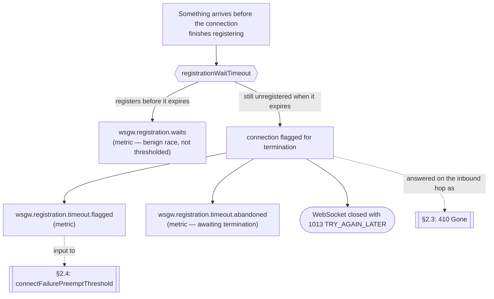
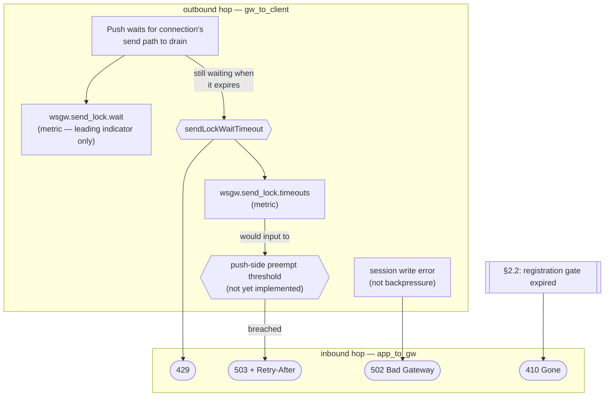
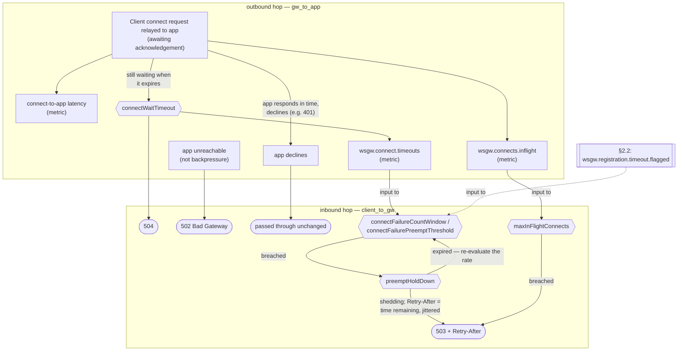
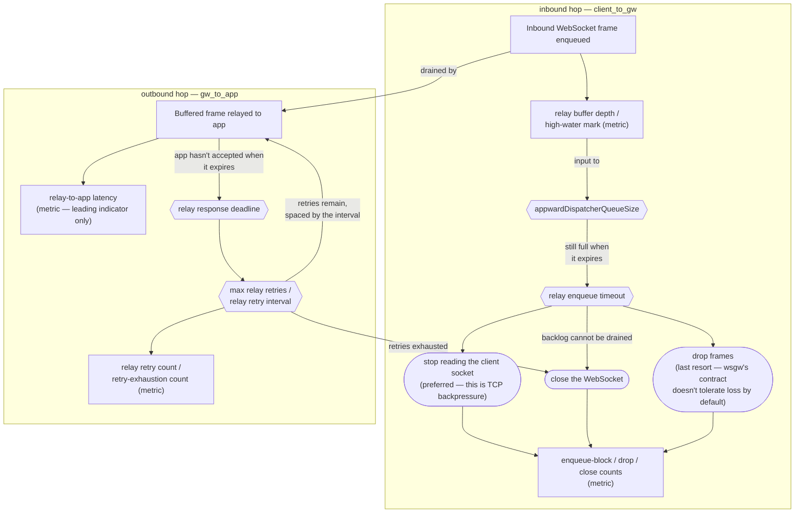

# Backpressure & Congestion Handling

This document is the single reference for the backpressure contract wsgw exposes:
how it detects congestion at each of its sites, what it does about it, and what it
tells its callers. It is written for two readers — the client author who must
handle the signals, and the operator who tunes the knobs and watches the metrics.

It is organized in two layers by depth of internal detail:

- **§1–§4 — the contract.** The external interface: signals, endpoints, knobs,
  metrics. Stable, and free of implementation references.
- **§5 — implementation & current status.** The implementor's working map: how
  much of the contract is live today, the internal mechanics behind it, and a
  per-element traceability table (§5.6) from contract to code. While the product
  is early-stage, this is the most active part of the document.

**How names are written here.** Configuration knobs appear in their camelCase
configuration form (`connectWaitTimeout`); metrics appear under their
Micrometer name, which is dot-separated (`wsgw.registration.waits`). The two are
told apart by shape alone — no other marker is needed. Metric *tags* are written
`tag=value` (`site=gw_to_client`).

The Micrometer name is the metric's identity; each monitoring backend renders it
into its own dialect. Under Prometheus that rendering is more than a separator
swap: tags become labels, and the exporter appends a type- and unit-dependent
suffix.

| Meter | Micrometer name | Prometheus exposition |
|---|---|---|
| `Counter` | `wsgw.registration.waits` | `wsgw_registration_waits_total` |
| `Timer` | `wsgw.send_lock.wait` | `wsgw_send_lock_wait_seconds_count`, `…_sum`, `…_max` |
| `Counter` | `wsgw.connect.timeouts` | `wsgw_connect_timeouts_total` |
| `Gauge` | `wsgw.connects.inflight` | `wsgw_connects_inflight` |

Tags ride along as labels, so the send-lock timer above is queried as
`wsgw_send_lock_wait_seconds_count{flow="push",site="gw_to_client"}`.

So a name from this document is not always paste-able into a Prometheus query —
derive it, or read it off the exporter. Note also that a *statistic* is not a
series: where this document says "average send-lock wait time", the query is that
timer's `_sum` divided by its `_count`.

A metric gets a name here once its meter exists; until then it is described in
prose, since the exact name and its tag dimensions are settled by the
implementation. The same holds for a knob: it gets a name here once a
configuration field exists under that exact name; until then it is described
in prose, since its exact name and shape are likewise settled by the
implementation, not by this document.

---

## 1. The signal contract (the vocabulary)

Three signals make up the entire backpressure vocabulary. Each means the same
thing wherever it is emitted, so a caller can treat the set as stable and key its
retry behaviour off the status code (and `Retry-After`).

| Signal | Meaning | Where the bottleneck is | `Retry-After` |
|---|---|---|---|
| **429 Too Many Requests** | This operation could not complete within its own wait budget. Reactive, per-request. | The gateway, right now, for this call. | Optional |
| **503 Service Unavailable** | The gateway is shedding load preemptively because a congestion metric crossed a configured threshold. Proactive. | The gateway, sustained. | Required |
| **504 Gateway Timeout** | The downstream app was too slow — it did not acknowledge a connect, or did not accept a relayed message, within its budget. | The backend app, not the caller. | Optional |

The axis that separates them: **429 and 503 say the client side is producing
faster than the gateway can drain** — 429 for a single call that ran out of
budget, 503 for "we've seen too much of that lately, back off." **504 says the
backend is slow** — a different party is at fault, so a caller's response should
differ.

One qualification on 503, because the axis above can mislead about it. 429 and
504 are *attributions*: each names the party whose behaviour caused this
particular call to fail. 503 is not an attribution. It is a protective measure
taken to keep the gateway stable, and the caller that receives it is generally
**not** the caller that caused the condition — it is simply the caller that
arrived while the condition held. A caller should read 503 as "the gateway is
conserving itself, come back later," and never as a judgement on its own rate.
This is also why `Retry-After` is required for 503 and optional elsewhere: the
caller has no way to infer from its own behaviour when someone else's condition
will clear, so the gateway must tell it.

Each signal carries a human-readable reason phrase for logs; programmatic callers key
off the status code and `Retry-After`.

New congestion sites (§2) map onto this same set rather than introducing codes of
their own — which is what lets a caller treat the vocabulary as fixed.

The three codes above are the *backpressure* vocabulary. A site may also answer
with an ordinary HTTP code that has nothing to do with congestion — **502** when
the app is unreachable, **410** when the addressed connection no longer exists
(§2.2). These are not backpressure signals, they are not covered by the stability
promise above, and they are documented at the site that emits them rather than
here.

---

## 2. Congestion catalog

### 2.1 Hops, flows and sites — the frame

The gateway has two peers, the client and the app, and it never talks to them
over the same transport. The app and the client never exchange anything
directly, so **the gateway is an endpoint of every segment in the system**:

```text
PUSH      app ────POST /message────► gw ────WS text frame────► client
CONNECT   client ──GET /connect────► gw ──GET /ws/connect────► app
RELAY     client ──WS frame────────► gw ──POST /ws/message───► app
```

Three words keep the rest of this section unambiguous:

- A **hop** is one segment between two adjacent parties over one transport —
  one arrow above. It has two endpoints, one of which is always the gateway.
  Congestion always happens on a hop, never on a flow.
- A **flow** is what a caller experiences end to end — one whole line above:
  one gateway-inbound hop plus one gateway-outbound hop. Three nodes, two
  segments. No hop spans app to client; that distance is a flow.
- A **site** is anywhere a call can be held up: made to wait, or refused
  outright. Every hop is a site; exactly one site is not a hop, which is the
  only reason `site` and `hop` are two words rather than one.

`hop` is a claim about topology, so only things with two endpoints and a wire
qualify. `site` is the label a meter is filed under, so it has to stretch to
cover the one place a call is held up that is not on any wire at all.

The six arrows above collapse to **four hops**, because `client_to_gw` and
`gw_to_app` are each shared by two flows.

| Flow | Inbound hop | Outbound hop |
|---|---|---|
| **PUSH** app → client | `app_to_gw` — `POST /message/{connectionId}` | `gw_to_client` — WebSocket text frame |
| **CONNECT** client → app | `client_to_gw` — `GET /connect` | `gw_to_app` — `GET /ws/connect/{connectionId}` |
| **RELAY** client → app | `client_to_gw` — inbound WebSocket frame | `gw_to_app` — `POST /ws/message/{connectionId}` |

And **five sites** — those four hops, plus the one that is not a hop.

| `site` | A hop? | What holds a call up there |
|---|---|---|
| `app_to_gw` | yes — PUSH inbound | nothing; this hop only answers |
| `gw_to_client` | yes — PUSH outbound | the connection's send path draining |
| `client_to_gw` | yes — CONNECT and RELAY inbound | admission refusal (CONNECT); waiting for relay buffer space (RELAY) |
| `gw_to_app` | yes — CONNECT and RELAY outbound | the app acknowledging (CONNECT) or accepting (RELAY) |
| `registration` | **no** — a connection state | the gateway becoming able to drive the connection |

That last row is the **registration gate** (§2.2), and it is deliberately not an
arrow in the sketch above. It is a state of a connection that *already exists* —
whether the gateway is yet able to drive it — so a call parked there is waiting
on a flag, not on a wire. All three flows meet it, none of them owns it, and
giving it its own section is what keeps its metrics from being filed under
whichever flow happened to notice them first.

**The two metric tags.** `flow` ∈ {`push`, `connect`, `relay`}, and `site` as
tabled above. The tag is `site` rather than `hop` precisely because of that last
row: tagging those meters `hop=registration` would assert that registration is a
segment between two parties, which is the kind of claim this section exists to
stop making. Neither tag is redundant — `site` alone cannot separate CONNECT
from RELAY, since both end on `gw_to_app`; and `flow` alone cannot separate the
registration gate from CONNECT's outbound hop, since both are `flow=connect`.

**The signal rule.** One rule governs the whole catalog:

> A signal is emitted on the flow's **inbound** hop, and reports congestion
> detected on its **outbound** hop.

This is why the outbound hops carry the interesting knobs and metrics while the
inbound hops carry the status codes, and why the two must not be conflated: the
place a caller *learns* about congestion is never the place the congestion *is*.

The rule also explains RELAY without making it a special case. Its inbound hop
is a WebSocket frame rather than an HTTP request, so there is no request in
flight to answer — the rule still holds, but the only signal it can carry is
nothing. §2.5 covers what the gateway does instead.

### 2.2 The registration gate — connection readiness

Not a hop; a state that all three flows meet. It exists because the WebSocket
connection becomes usable by its two *peers* before it becomes usable by the
*gateway*.

**Why the gap exists.** This is specific to the Jakarta framework used for this
implementation: the framework makes the fully functional connection available to
the application asynchronously in a callback — a remnant of the pre-Loom Java
versions where load could only be scaled up using reactive mechanisms. Due to
this asynchronicity, the connection becomes available to both the WebSocket
client and the application even before it is made available to the gateway
implementation (and before the gateway becomes able to take over managing the
traffic over the connection).

So when a new WebSocket connection is opened, a sub-millisecond window may be
open in which the app has been notified about the new connection and has
received the connection id, while the connection is not yet usable by the
gateway.

**Trigger.** Anything that needs the connection arrives while the gateway is
still inside that window. In practice that is a push (§2.3), which must park at
the gate before it can reach the `gw_to_client` hop.

**Knobs.**

| Knob | Controls |
|---|---|
| `registrationWaitTimeout` | How long the gateway is willing to stay in this window before declaring the connection definitively unusable. When it expires, the gateway *flags the connection for termination*. |

**Metrics.**

| Metric | Meaning |
|---|---|
| `wsgw.registration.waits` | Connections where something arrived before the connection had finished establishing. This counts the *race*, which is benign and normally clears in under a millisecond. It is not a distress signal, and thresholding it would shed load during healthy operation. |
| `wsgw.registration.timeout.flagged` | Connections flagged for termination because `registrationWaitTimeout` expired before they registered. Every increment is one connection flagged, so unlike the race count above this **is** a distress signal. It is also a direct count of establishments that failed, which is why §2.4 uses it as an input to `connectFailurePreemptThreshold`. |
| `wsgw.registration.timeout.abandoned` | Gauges the number of connections flagged, but still awaiting termination. |

**These are CONNECT-flow metrics** (`flow=connect`, `site=registration`), not
PUSH-flow metrics, even though a push is usually the caller that discovers the
condition. A registration timeout is an establishment that did not complete;
that a push was the one holding the stopwatch is incidental. §2.4 consumes them
on exactly that reading.

**What flagging does.** Flagged connections don't relay messages coming from the
client, so a flagged connection is dead in the RELAY direction as well as the
PUSH direction. The connection is terminated when the Jakarta framework finally
makes the fully functional connection available to the application, and is
closed with **1013** (`TRY_AGAIN_LATER`) and a short reason phrase. The place of
the termination has been chosen in the workflow on the assumption that, if the
connection establishment went as far as to provide a connection id to the app
which has come to the gateway requesting to push a message to the client over
the connection, the Jakarta framework will eventually register the connection
and removal from the map will eventually happen.
`wsgw.registration.timeout.abandoned` is gauging the count of flagged
connections where actual termination is yet to happen.

**Signals.** None of its own — the gate has no inbound hop. A caller parked at
it is on some flow's inbound hop, and that hop answers: §2.3 turns a gate
timeout into **410 Gone**.

**Dependencies.**



### 2.3 PUSH — app → client

#### 2.3.1 Inbound hop `app_to_gw` — where the signals are emitted

**Entry point.** `POST /message/{connectionId}` — the app hands the gateway a
payload to deliver as a text frame on the client's WebSocket.

This hop carries no congestion of its own. Its whole job is to answer for what
happened at the registration gate (§2.2) and on the outbound hop (§2.3.2).

**Signals.**

| Condition | Signal |
|---|---|
| Send path fails to drain within `sendLockWaitTimeout` (§2.3.2) | **429** |
| Connection not registered within `registrationWaitTimeout` (§2.2) | Connection **flagged for termination**; push answers **410 Gone**, no `Retry-After` |
| Push-side preempt threshold exceeded *(not yet implemented)* | **503** + `Retry-After` |
| Session write error (not backpressure) | **502 Bad Gateway** |

**A transport-level failure on this request is not a backpressure signal.** The
caller's connection to the gateway can be closed by ordinary HTTP keep-alive
expiry — invisible from outside and independent of load — so a POST to this
endpoint can fail with no response at all even while the gateway is otherwise
healthy and none of §1's codes apply. This is the same class of failure any HTTP
server can produce for any pooled client connection; it is not specific to
congestion, and wsgw cannot distinguish "the message never arrived" from "the
response was lost after the message arrived." Callers must retry such failures
on a fresh connection themselves, which — as with §2.5's retry contract for
RELAY — means accepting occasional duplicate delivery as the cost of
at-least-once semantics on this flow.

#### 2.3.2 Outbound hop `gw_to_client` — where the congestion is

**Trigger.** Delivery does not complete within its budget, typically because the
gateway↔client link is slow, which keeps that connection's send path busy so
further pushes to the same connection queue behind it.

**Knobs.**

| Knob | Controls |
|---|---|
| `sendLockWaitTimeout` | How long a push — over a fully functional WebSocket connection — can accumulate on `wsgw.send_lock.wait` before failing with 429. The push-congestion budget proper. |
| push-side preempt threshold *(not yet implemented — no configuration field exists)* | `wsgw.send_lock.timeouts` occurring too frequently, above which the gateway would shed subsequent pushes preemptively with 503. |

**Metrics.**

| Metric | Meaning |
|---|---|
| `wsgw.send_lock.wait` | How long pushes wait for the connection's send path to free up; the leading indicator of push congestion. Recorded around the `sendLock` acquisition itself, so a wait that ends in a timeout (→ 429) is included alongside successful acquisitions. |
| `wsgw.send_lock.timeouts` | Counts the timeouts already noted in `wsgw.send_lock.wait` above; would input to the push-side preempt threshold, once that exists. |

Both carry `flow=push`, `site=gw_to_client`.

Note that a push-side threshold cannot be relieved by admission control the way
§2.4's can: it governs long-lived connections that already exist, so there are no
new arrivals to refuse.

**Dependencies.**



### 2.4 CONNECT — client → app

#### 2.4.1 Inbound hop `client_to_gw` — admission, and where the signals are emitted

**Entry point.** `GET /connect` — the gateway relays the client's connection
request to the app and only completes the WebSocket upgrade if the app accepts.

Unlike PUSH's inbound hop, this one does carry a control of its own: admission.
It is the door, so it is the only place new arrivals can be refused.

**Knobs.**

| Knob | Controls |
|---|---|
| `maxInFlightConnects` | Admission bound on concurrent connection establishments. Compared against `wsgw.connects.inflight` (§2.4.2). |
| `connectFailureCountWindow` / `connectFailurePreemptThreshold` | Establishment failures within a rolling window of `connectFailureCountWindow` above which the gateway sheds *new* connections with 503, once the count exceeds `connectFailurePreemptThreshold`. Two metrics count toward it: `wsgw.connect.timeouts` (§2.4.2) and `wsgw.registration.timeout.flagged` (§2.2). Note this is a different knob pair from §2.3.2's push-side preempt threshold, which sheds pushes on connections that already exist; the two never refer to each other, and neither one's breach affects the other's flow. |
| `preemptHoldDown` | Once `connectFailurePreemptThreshold` trips, how long the gateway keeps shedding before it looks at the failure rate again. Also the basis for the `Retry-After` it sends while shedding. |

Shedding new connections is the remedy that matches this cause. Establishment is
a transient, bounded activity, so refusing new arrivals lets the pipeline drain,
after which the rate falls and the threshold clears itself.

**That self-clearing is also why the threshold needs a hold-down.** A bare "shed
while the rate is above the threshold" rule oscillates: shedding cuts the
arrival rate, so failures fall, so the threshold clears, so the flood resumes and
trips it again. The gateway therefore stays in shedding mode for the whole of
`preemptHoldDown` once tripped, and only re-evaluates the rate when it expires.
The hold-down is not a second threshold — it is what keeps the first one from
chattering.

**`Retry-After` is the time remaining on the hold-down.** §1 requires
`Retry-After` on 503 because a caller cannot infer when a condition it did not
cause will clear. Here the gateway does know, so it should send what it knows
rather than a constant: a fixed value sends callers back while the gate is still
shut, and one that outlives the hold-down wastes capacity. The value must also
carry jitter — every caller shed in the same window would otherwise return in
lockstep and the herd would re-trip the threshold on the first evaluation after
the gate opens, which is the oscillation the hold-down exists to prevent,
re-entered from the client side.

Neither applies to the admission bound. `maxInFlightConnects` is a level that
falls as connects complete, so it clears on its own without chattering, and its
503 carries a best-effort `Retry-After` rather than a known remainder.

**Signals.**

| Condition | Signal |
|---|---|
| App acknowledgement exceeds `connectWaitTimeout` (§2.4.2) | **504** |
| `connectFailurePreemptThreshold` exceeded within `connectFailureCountWindow` | **503** + `Retry-After` = jittered time remaining on `preemptHoldDown` |
| Admission bound exceeded | **503** + best-effort `Retry-After` |
| App unreachable (not backpressure) | **502 Bad Gateway** |
| App declined the connect (e.g. 401) | passed through unchanged |

#### 2.4.2 Outbound hop `gw_to_app` — where the congestion is

**Entry point.** `GET /ws/connect/{connectionId}` on the app.

**Trigger.** The app is slow to acknowledge the connection request.

**Knobs.**

| Knob | Controls |
|---|---|
| `connectWaitTimeout` | How long the gateway waits for the app's connect acknowledgement before failing with 504. |

**Metrics.**

| Metric | Meaning |
|---|---|
| `wsgw.connects.inflight` | Connection establishments currently awaiting the app. Measured here; consumed by `maxInFlightConnects` at the door. |
| connect-to-app latency | How long the app takes to acknowledge. |
| `wsgw.connect.timeouts` | Connects that exceeded the wait timeout. |

Both named meters carry `flow=connect`, `site=gw_to_app`.

`wsgw.connect.timeouts` and `wsgw.registration.timeout.flagged` (§2.2) both
feed `connectFailurePreemptThreshold`, and both are counts of
establishments that failed — the first observed while waiting for the app's
acknowledgement, the second observed when the registration gate expired. They
differ only in where the failure was noticed. Adding them is therefore sound
rather than a convenience: the sum is the rate at which connection
establishment is not completing, which is precisely what the threshold exists
to watch.

The other two metrics do not feed that threshold. `wsgw.connects.inflight` is
a level rather than a failure count, and it is the input to the admission bound;
connect-to-app latency is a leading indicator only.

**Dependencies.**



### 2.5 RELAY — client → app

#### 2.5.1 Inbound hop `client_to_gw` — the buffer, and the actions in place of signals

**Entry point.** An inbound WebSocket frame from the client. Each connection has
its own bounded relay buffer, which the receiving side fills and the outbound
hop drains.

**Trigger.** The client produces frames faster than the app drains them, so the
connection's relay buffer fills.

**The asymmetry.** By the signal rule (§2.1) this hop is where a signal would be
emitted — but the trigger arrived as a WebSocket frame, so there is no HTTP
request in flight to reject and none of §1's status codes apply. What the
gateway does instead is act on the connection itself. Three actions are
available, and they occupy the same slot a signal would: each is the terminal
step of a congestion decision, aimed back at the producer.

- **Stop reading the client socket (preferred)** — the OS flow-control window
  closes and the client's writes stall. This is TCP backpressure: the closest
  analogue to natural backpressure, and it loses no data.
- **Close the WebSocket** — terminate a connection whose backlog cannot be
  drained, using an application close code.
- **Drop frames** — discard them; only acceptable if the message contract
  tolerates loss, which wsgw's does not by default. Last resort.

**Knobs.**

| Knob | Controls |
|---|---|
| `appwardDispatcherQueueSize` | Per-connection relay buffer bound. |
| relay enqueue timeout | How long the relay may wait for buffer space before taking one of the three actions above. |

**Metrics.**

| Metric | Meaning |
|---|---|
| relay buffer depth / high-water mark | Fill level per connection; the only early warning for this flow. |
| enqueue-block / drop / close counts | How often each of the three actions was taken. |

**Signals.** None over HTTP — see the three actions above. Because relay congestion
cannot turn a request red, it is observable only through the buffer-depth and
retry metrics until it escalates to a WebSocket close.

#### 2.5.2 Outbound hop `gw_to_app` — where the congestion is

**Entry point.** `POST /ws/message/{connectionId}` on the app, driven by the
per-connection drain.

**Knobs.**

| Knob | Controls |
|---|---|
| relay response deadline | How long the gateway waits for the app to accept a relayed message. On expiry the message is re-sent, up to `max relay retries`; once those are exhausted the connection is closed. |
| max relay retries | How many times a message whose deadline expired is re-sent before the gateway gives up on the connection. This knob alone decides *whether* retries happen: zero means the first deadline expiry closes the connection. |
| relay retry interval | How long the gateway waits between retries, in milliseconds. Spacing only — it has no bearing on whether a retry is attempted. |

**Metrics.**

| Metric | Meaning |
|---|---|
| relay-to-app latency | How long the app takes to accept a relayed message. |
| relay retry count | Messages re-sent after a deadline expiry. A rising count means the drain is stalling before the buffer shows it. |
| retry-exhaustion count | Connections closed because their retries ran out. Every increment is one connection destroyed and one client forced to reconnect, so this is the distress signal of the pair. |

**Retry is re-delivery.** A deadline expiry does not mean the app failed to
process the message — the response may merely be late. Retrying therefore makes
relay delivery at-least-once, so `POST /ws/message/{connectionId}` must be
idempotent or otherwise tolerate duplicates. That is part of the app-side
contract, not an implementation detail.

**The two relay budgets interact — across the two hops.** Retries occupy the
connection's single drain path, so the worst-case head-of-line stall is
`(max relay retries + 1) × relay response deadline + max relay retries × relay
retry interval`. A stalled drain is exactly what fills the buffer on the inbound
hop, so if the relay enqueue timeout is shorter than that stall, an exhausted
retry sequence on a busy connection also trips the enqueue timeout and the
operator sees two actions fire from one cause. The two budgets have to be tuned
against each other even though they sit on different hops.

**Dependencies.**



---

## 3. Cross-effects

The flows are not independent; the matrix in §4 exists to keep the couplings
visible.

- **The registration gate couples CONNECT to both message flows.** §2.2 is
  reached by a push that must wait, and its expiry costs a connection that the
  client was also using to reach the app. So slow establishment does not merely
  delay pushes; it destroys connections, and each loss forces a client to
  reconnect, which feeds more work back into the same slow CONNECT flow. That
  loop is why `wsgw.registration.timeout.flagged` is an input to §2.4's
  `connectFailurePreemptThreshold`: shedding new connections is what breaks it.

  This is distinct from PUSH congestion proper (§2.3.2), which answers 429 and
  leaves the connection intact. The two are told apart by which metric moves: a
  spike in `wsgw.registration.timeout.flagged` points at establishment, a spike
  in average send-lock wait time points at the `gw_to_client` hop. Both surface
  on the same inbound hop, which is exactly why they need different metrics to
  be distinguishable.

- **Slow RELAY has no request-level symptom.** Unable to emit a signal, relay
  congestion stays invisible to HTTP callers and shows only in buffer depth until
  it escalates to a close. Operators must watch that metric directly.

- **The two relay budgets straddle RELAY's own two hops** — see §2.5.2.

---

## 4. Congestion matrix (operator quick-reference)

| Flow / site | Hop | Trigger | HTTP request to answer? | Knobs | Key metrics | Signal (when) |
|---|---|---|---|---|---|---|
| **registration gate** (shared) | — (connection state) | Connection not usable by the gateway yet | No — answered on whichever inbound hop is waiting | `registrationWaitTimeout` | `wsgw.registration.waits`; `wsgw.registration.timeout.flagged`; `wsgw.registration.timeout.abandoned` | 410 via PUSH's inbound hop; connection flagged, closed 1013 |
| **PUSH** app→client | `app_to_gw` | — (answers only) | Yes — `POST /message/{id}` | — | — | 429; 410; 503+`Retry-After` (planned); 502 |
| **PUSH** app→client | `gw_to_client` | Delivery exceeds budget (slow client link) | No | `sendLockWaitTimeout`; push-side preempt threshold (planned) | avg send-lock wait; `wsgw.send_lock.timeouts` | — (surfaces on `app_to_gw`) |
| **CONNECT** client→app | `client_to_gw` | Too many arrivals, or too many recent failures | Yes — `GET /connect` | `maxInFlightConnects`; `connectFailureCountWindow` / `connectFailurePreemptThreshold`; `preemptHoldDown` | — (consumes the two below) | 503+`Retry-After` (admission, or threshold for the rest of the hold-down) |
| **CONNECT** client→app | `gw_to_app` | App slow to ack | No | `connectWaitTimeout` | `wsgw.connects.inflight`; connect latency; `wsgw.connect.timeouts` | — (surfaces on `client_to_gw` as 504) |
| **RELAY** client→app | `client_to_gw` | Client outpaces app drain; buffer fills | **No** — WebSocket frame | `appwardDispatcherQueueSize`; enqueue timeout | buffer depth/high-water; block/drop/close counts | none over HTTP → stop reading socket → WS close |
| **RELAY** client→app | `gw_to_app` | App slow to accept a relayed message | No | response deadline; max retries; retry interval | relay latency; retry & retry-exhaustion counts | none over HTTP → retry → WS close |

---

## 5. Implementation & current status

This layer records how much of the contract above is live today and the internal
mechanics behind it. Status tags: `[implemented]`, `[partial]`, `[planned]`.

### 5.1 The registration gate

Handled by `WsConnection.waitForSessionRegistrationToComplete`, reached through
`WsConnections.push`.

- **`registrationWaitTimeout`** — `[partial]`. The *patient* wait absorbing the
  push-before-register race (Tomcat runs `onOpen` after the 101 is flushed). Fed
  from `Configuration.getRegistrationWaitTimeout()`, which today returns a
  hardcoded 10s and is backed by no settable field. It is wired separately from
  `sendLockWaitTimeout` (a distinct getter, a distinct `Timeouts` component), so
  the two are structurally independent — they merely happen to hold the same
  hardcoded value.
- **Race count** — `[partial]`. A Micrometer `Counter`,
  `wsgw.registration.waits` tagged `flow=connect`, `site=registration`,
  registered eagerly in the `WsConnections` constructor (so the series reads 0
  rather than missing before the first race) and incremented once per raced
  connection. `Wsgw` holds a `SimpleMeterRegistry`, which records the value in
  memory but exports it nowhere — no scrape endpoint yet, so the counter is
  observable only in-process (which is what the unit tests read).
- **Termination workflow on registration timeout** — `[partial]`. Today, on timeout,
    1. the connection is flagged for termination (`registrationTooLate`) and the
       app's push request is rejected with HTTP 410 *Gone*.
    2. a flagged connection is closed with **1013** (`TRY_AGAIN_LATER`) and
       a short reason phrase.
- **`wsgw.registration.timeout.flagged` / `.abandoned` over-count** — `[known defect]`.
  Both meters, and `CircuitBreaker.increment()`, are driven from the
  `ConnectionGone` catch in `WsConnections.push`. But
  `waitForSessionRegistrationToComplete` also throws `ConnectionGone` on *every
  subsequent* push to an already-flagged connection, while `register` decrements
  `.abandoned` once. So N pushes to one flagged connection produce N increments
  and one decrement: the gauge drifts upward and the circuit breaker is
  over-fed. The fix is the same per-connection-vs-per-call distinction already
  applied to `wsgw.registration.waits` — count on the transition into
  `registrationTooLate`, not on every throw.

### 5.2 PUSH

Handled by `WsConnections.push`, invoked from the `MessageRequest` filter.

- **429 on `sendLockWaitTimeout`** — `[partial]`. `MessageRequest` returns 429
  (`"Retry later"`) when `push` throws `SendLockWaitTimedOut`. No `Retry-After`
  header yet.
- **`sendLockWaitTimeout`** — `[partial]`. The *fast-fail* wait on the
  per-session send lock (a `ReentrantLock`), read from
  `Configuration.getSendLockWaitTimeout()`, which today returns a hardcoded 10s
  and is backed by no settable field.
- **Average send-lock wait time** — `[partial]`. A Micrometer `Timer`,
  `wsgw.send_lock.wait` tagged `flow=push`, `site=gw_to_client`, wraps the
  `sendLock.tryLock` call in `WsConnection.sendMessage` and records the wait
  whether it succeeds or times out. Same `SimpleMeterRegistry` caveat as
  above — recorded, not exported.
- **`wsgw.send_lock.timeouts`** — `[partial]`. A Micrometer `Counter`, same tags,
  incremented on the `tryLock` failure. Same registry caveat.
- Push-side preempt threshold and its 503 — `[planned]`.

### 5.3 CONNECT

Handled by the `ConnectionRequest` filter (`registerWithApp`).

- **504 on connect timeout** — `[implemented]`. `ConnectionRequest` passes
  `connectWaitTimeout` (from `Configuration.getConnectWaitTimeout()`, default 10s)
  as the request timeout on the `Request.send` call to the app. When the app does
  not respond in time, `HttpTimeoutException` is caught and mapped to **504**
  (`"request timed out"`). Failure to reach the app still maps to **502**; a
  non-204 app answer (e.g. 401) is passed through.
- **Admission bound + 503** — `[partial]`. `ConnectionRequest` reads
  `maxInflightConnections` (from `Configuration.getMaxInFlightConnects()`, default
  10 000) and answers **503** when the in-flight count exceeds it. No `Retry-After`
  header yet.
- **`wsgw.connects.inflight`** — `[partial]`. A Micrometer `Gauge` backed by an
  `AtomicInteger` in `ConnectionRequest`, tagged `flow=connect`, `site=gw_to_app`;
  incremented on entry, decremented in `finally`. Same `SimpleMeterRegistry`
  caveat as PUSH metrics — recorded, not exported.
- **`wsgw.connect.timeouts`** — `[partial]`. A Micrometer `Counter` in
  `ConnectionRequest`, same tags, incremented when `HttpTimeoutException` is
  caught. Same `SimpleMeterRegistry` caveat.
- **`connectFailureCountWindow` / `connectFailurePreemptThreshold`, `preemptHoldDown`, jittered `Retry-After`** — `[implemented]`.
  `CircuitBreaker` holds the windowed failure count (`connectFailureCountWindow`,
  `connectFailurePreemptThreshold`) as decision state separate from the export
  meters above. Both `wsgw.connect.timeouts` (in `ConnectionRequest`, on
  `HttpTimeoutException`) and `wsgw.registration.timeout.flagged` (in
  `WsConnections.push`, on `ConnectionGone`) feed the same shared instance via
  `increment()`. Once the count exceeds the threshold, `CircuitBreaker` sheds for
  `preemptHoldDown` and does not re-arm until it elapses — further increments
  during hold-down don't extend it. `ConnectionRequest.doFilter` checks
  `CircuitBreaker.jitteredRemaining()` first and answers **503** with
  `Retry-After` set to that value while shedding. `jitteredRemaining()` scales
  the true remaining hold-down by a random fraction in `[0.5, 1.0]` so callers
  shed at different points during the same hold-down don't all retry at the
  instant the gate reopens (which would just re-trip the threshold).
  Note that the `ConnectionGone` feed inherits the over-count in §5.1.
- Connect-to-app latency metric and `Retry-After` on admission 503 —
  `[planned]`.

### 5.4 RELAY

Handled per connection by `Relay` / `Dispatcher` (a single virtual thread
draining a bounded `LinkedBlockingQueue`), created via `Relays`.

- **Bounded buffer** — `[implemented]`. `appwardDispatcherQueueSize`
  (`APPWARD_DISPATCHER_QUEUE_SIZE`, default 1024) bounds the queue.
- **Fast-fail / signalling on the inbound hop** — `[planned]`. When the queue is
  full, `Dispatcher.accept` calls `queue.put()`, which **blocks the
  WebSocket-receiving thread** — buffering, but no enqueue timeout, no
  stop-reading, no close, no metric. This is the rawest instance of the problem:
  the block is cheap, so nothing throttles the client.
- Relay response deadline, the retry-then-close escalation behind it, and all
  RELAY metrics — `[planned]`. `Request.appClient` carries no per-request
  timeout today, so nothing bounds a relay whose app never answers, and there is
  no retry path to hang off that bound.

### 5.5 Metric tags

`flow` and `site` are applied at meter registration in
`WsConnections.Meters.create` and `ConnectionRequest.Meters.create`. They
replace an earlier single `leg` tag, which named a flow but was applied as if it
named a hop — which is how the registration meters came to be tagged `push`
despite counting establishment failures (§2.2). No exporter is wired yet, so the
tags are currently visible only to the in-process tests that read them back.

### 5.6 Traceability: contract element → code → status

Each row anchors one §1–§4 contract element to the code that implements it (or
would), so an implementor can jump straight from "what's missing" to the site to
touch.

| Contract element | Code site | Status | Gap |
|---|---|---|---|
| §2.2 `registrationWaitTimeout` (gate budget) | `Timeouts.registrationWaitTimeout()`; value from `Configuration.getRegistrationWaitTimeout()` | `[partial]` | hardcoded 10s, no settable field; structurally independent of `sendLockWaitTimeout` |
| §2.2 `wsgw.registration.waits` | `WsConnections.push` (`registrationWaits` counter, `flow=connect`/`site=registration`) | `[partial]` | recorded into `SimpleMeterRegistry` with no exporter → not scrapeable |
| §2.2 `wsgw.registration.timeout.flagged` | `WsConnection.waitForSessionRegistrationToComplete` (tombstone via `registrationTooLate`) + `WsConnection.registerSession` (1013 close on late arrival) + `WsConnections.push` (`registrationTimeoutFlagged` counter) | `[partial]` | over-counts: incremented on every `ConnectionGone` throw, not once per flagged connection (§5.1) |
| §2.2 `wsgw.registration.timeout.abandoned` | `WsConnections` (`Gauge` over `AtomicInteger`); incremented in `push` (`ConnectionGone` catch), decremented in `register` (tombstone path) | `[partial]` | same over-count; N increments to 1 decrement (§5.1) |
| §2.2 close code 1013 on termination | `WsConnection.registerSession` | `[implemented]` | |
| §2.3.1 signal 410 (connection flagged) | `MessageRequest.doFilter` (`ConnectionGone` → 410) | `[implemented]` | |
| §2.3.1 signal 429 (send-lock timeout) | `MessageRequest.doFilter` (`SendLockWaitTimedOut` → 429) | `[partial]` | no `Retry-After` |
| §2.3.1 signal 503 + push-side preempt threshold | — | `[planned]` | no configuration field exists yet for the threshold or its window |
| §2.3.2 `sendLockWaitTimeout` (send-desaturation budget) | `Timeouts.sendLockWaitTimeout()`; value from `Configuration.getSendLockWaitTimeout()` | `[partial]` | hardcoded 10s, no settable field |
| §2.3.2 metric average send-lock wait time | `WsConnection.sendMessage` → `wsgw.send_lock.wait` (`Timer`, `flow=push`/`site=gw_to_client`); registry from `Wsgw.meterRegistry` | `[partial]` | recorded into `SimpleMeterRegistry` with no exporter → not scrapeable |
| §2.3.2 metric `wsgw.send_lock.timeouts` | `WsConnection.sendMessage` → `wsgw.send_lock.timeouts` (`Counter`, same tags) | `[partial]` | not scrapeable; would feed the 503 threshold above once that exists |
| §2.4.1 `maxInFlightConnects` + 503 signal | `ConnectionRequest.doFilter` (`inFlights > maxInflightConnections` → 503) | `[partial]` | no `Retry-After` |
| §2.4.1 `connectFailureCountWindow` / `connectFailurePreemptThreshold` / `preemptHoldDown` | `CircuitBreaker` (windowed count as decision state, separate from the export meters); constructed in `Wsgw` from `Configuration.getConnectFailureCountWindow()` / `getConnectFailurePreemptThreshold()` / `getPreemptHoldDown()`; checked and incremented from `ConnectionRequest.doFilter` and `WsConnections.push` | `[implemented]` | admission bound's own `Retry-After` (row above) is still separate and still missing; the `WsConnections.push` feed inherits §5.1's over-count |
| §2.4.1 `Retry-After` = jittered remainder | `CircuitBreaker.jitteredRemaining()`; read by `ConnectionRequest.doFilter` when answering 503 | `[implemented]` | random fraction in `[0.5, 1.0]` of `CircuitBreaker.remaining()`, via an injectable `DoubleSupplier` (mirrors the `Clock` injection already used for the window/hold-down math) |
| §2.4.2 `connectWaitTimeout` + 504 signal | `ConnectionRequest`: `connectWaitTimeout` from `Configuration.getConnectWaitTimeout()` (default 10s); passed as request timeout to `Request.send`; `HttpTimeoutException` → 504 | `[implemented]` | |
| §2.4.2 metric `wsgw.connects.inflight` | `ConnectionRequest` → `Gauge` over `AtomicInteger` (`flow=connect`/`site=gw_to_app`) | `[partial]` | not scrapeable |
| §2.4.2 metric `wsgw.connect.timeouts` | `ConnectionRequest` → `Counter` (same tags); incremented on `HttpTimeoutException` | `[partial]` | not scrapeable; also feeds `CircuitBreaker`, the preempt threshold's decision state |
| §2.4.2 connect-to-app latency metric | `ConnectionRequest.registerWithApp` | `[planned]` | |
| §2.5.1 `appwardDispatcherQueueSize` | `Configuration` (`APPWARD_DISPATCHER_QUEUE_SIZE`, 1024) → `Dispatcher` queue | `[implemented]` | |
| §2.5.1 relay enqueue timeout + its three actions + metrics | `Dispatcher.accept` (`queue.put()` blocks when full) | `[planned]` | no fast-fail, no stop-reading / WS close, no metric |
| §2.5.2 relay response deadline | `Request.appClient` | `[planned]` | no per-request timeout, so nothing bounds a relay the app never answers |
| §2.5.2 retry-then-close escalation (max relay retries, retry interval) | `Dispatcher` drain loop | `[planned]` | blocked on the deadline row above — there is no expiry event to retry from; also needs the at-least-once duplicate tolerance stated in §2.5.2 agreed with the app side |
| §2.5.2 metrics relay retry count / retry-exhaustion count | — | `[planned]` | retry-exhaustion is the flow's distress signal; no meter yet |
| §1 uniform `Retry-After` on 429/503 | — | `[planned]` | |
